# BlynkGO_font
Font สำหรับจอ TFT ด้วย BlynkGO  

## วิธีการใช้งาน BlynkGO font
- Save โปรเจค แล้วเปิดโฟลเดอร์โปรเจคนั้นขึ้นมา  
โดยเข้าไปที่เมนู `Sketch > Show Sketch Folder`  
  
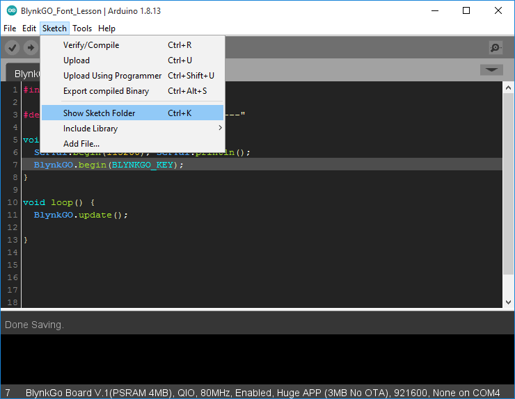

- ให้สำเนา  ฟอนต์ c file ไปวางไว้ใน folder ของโปรเจคที่ต้องการ 

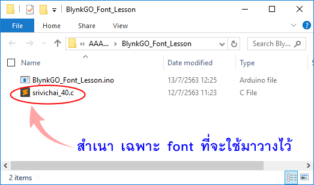
  
- ปิดโปรเจคแล้วเปิดใหม่ จะพบมี tab ฟอนต์ที่ต้องการได้เพิ่มเข้ามา  
ให้ประกาศ `FONT_DECLARE(...);` ก่อนการใช้งานฟอนต์นั้น  

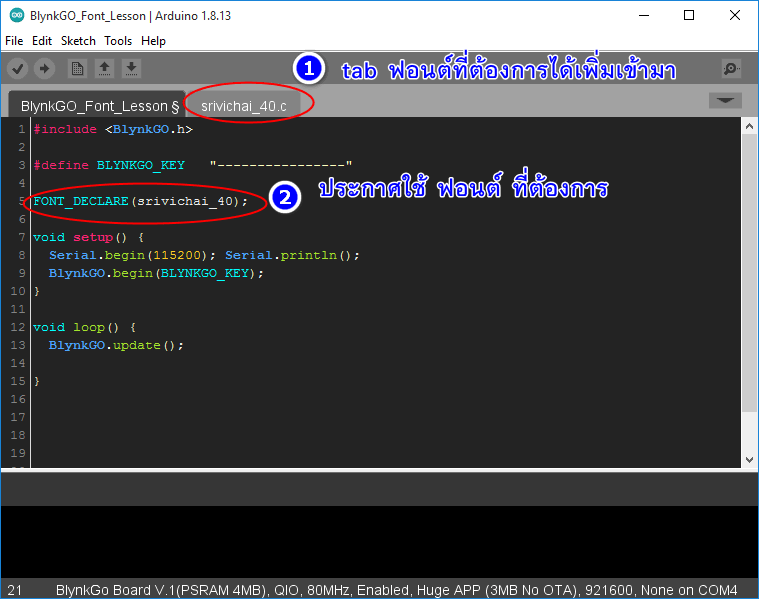  

- นำฟอนต์ไปใช้ในวิตเจตที่ต้องการ

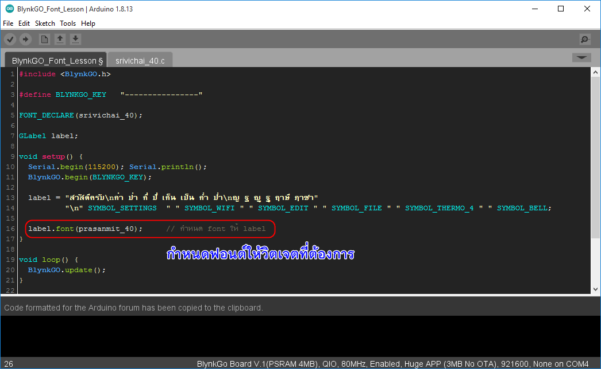  

  
```cpp
#include <BlynkGO.h>

#define BLYNKGO_KEY    "---------------"

FONT_DECLARE(fonleb_35);   // ประกาศ ฟอนต์ ก่อนที่จะใช้งาน

GLabel label;

void setup(){
  Serial.begin(115200); Serial.println();
  BlynkGO.begin(BLYNKGO_KEY);

  label = "สวัสดีครับ";
  label.font(fonleb_35); // กำหนดให้ label แสดงด้วยฟอนต์ fonleb_35
}

void loop(){
  BlynkGO.update();
}
```
**หมายเหตุ** 
ฟอนต์ประสานมิตร ขนาด 20, 25, 30, 35, 40
ผู้ใช้ สามารถเรียกใช้ได้เลยโดยไม่ต้องประกาศ `FONT_DECLARE(...);` อีก
- prasanmit_20 
- prasanmit_25 
- prasanmit_30 
- prasanmit_35 
- prasanmit_40 

## วิธีการใช้งาน สัญลักษณ์ ( symbol )
- เลือก font ที่มี SYMBOL อยู่ภายใน  
แล้วกำหนดให้ GLabel ตรงๆ ด้วยเครื่องหมาย = 

```cpp
#include <BlynkGO.h>

#define BLYNKGO_KEY    "---------------"

FONT_DECLARE(fonleb_35);   // ประกาศ ฟอนต์ ก่อนที่จะใช้งาน

GLabel label;

void setup(){
  Serial.begin(115200); Serial.println();
  BlynkGO.begin(BLYNKGO_KEY);

  label = SYMBOL_HOME;
  label.font(fonleb_35); // กำหนดให้ label แสดงด้วยฟอนต์ fonleb_35
}

void loop(){
  BlynkGO.update();
}
```
  
## SYMBOL สัญลักษณ์ที่สามารถใช้ได้  
|    SYMBOL       |    สัญลักษณ์   |
| -------------   |      :---:    |
| SYMBOL_AUDIO    |  |
| SYMBOL_VIDEO    |  |
| SYMBOL_LIST     |  |
| SYMBOL_OK       |  |
| SYMBOL_POWER    |  |
| SYMBOL_SETTINGS |  |
| SYMBOL_TRASH    |  |
| SYMBOL_HOME     |  |
| SYMBOL_DOWNLOAD |  |
| SYMBOL_DRIVE |  |
| SYMBOL_REFRESH |  |
| SYMBOL_MUTE |  |
| SYMBOL_VOLUME_MID |  |
| SYMBOL_VOLUME_MAX |  |
| SYMBOL_IMAGE |  |
| SYMBOL_EDIT |  |
| SYMBOL_PREV |  |
| SYMBOL_PLAY |  |
| SYMBOL_PAUSE |  |
| SYMBOL_STOP |  |
| SYMBOL_NEXT |  |
| SYMBOL_EJECT |  |
| SYMBOL_LEFT |  |
| SYMBOL_RIGHT |  |
| SYMBOL_ARROW_LEFT |  |
| SYMBOL_ARROW_RIGHT |  |
| SYMBOL_ARROW_UP |  |
| SYMBOL_ARROW_DOWN |  |
| SYMBOL_PLUS |  |
| SYMBOL_MINUS |  |
| SYMBOL_WARNING |  |
| SYMBOL_SHUFFLE | 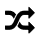 |
| SYMBOL_UP |  |
| SYMBOL_DOWN |  |
| SYMBOL_LOOP |  |
| SYMBOL_DIRECTORY |  |
| SYMBOL_UPLOAD |  |
| SYMBOL_CALL |  |
| SYMBOL_CUT |  |
| SYMBOL_COPY |  |
| SYMBOL_SAVE |  |
| SYMBOL_CHARGE |  |
| SYMBOL_BELL |  |
| SYMBOL_KEYBOARD |  |
| SYMBOL_GPS |  |
| SYMBOL_FILE |  |
| SYMBOL_ARROW_LONG_LEFT |  |
| SYMBOL_WIFI |  |
| SYMBOL_BATTERY_FULL |  |
| SYMBOL_BATTERY_3 |  |
| SYMBOL_BATTERY_2 |  |
| SYMBOL_BATTERY_1 |  |
| SYMBOL_BATTERY_EMPTY |  |
| SYMBOL_BLUETOOTH | 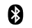 |
| SYMBOL_THERMO_4 | 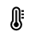 |
| SYMBOL_THERMO_3 | 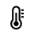 |
| SYMBOL_THERMO_2 | 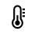 |
| SYMBOL_THERMO_1 | 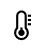 |
| SYMBOL_THERMO_0 | 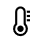 |
| SYMBOL_SHOWER |  |
| SYMBOL_BATHROOM |  |
| SYMBOL_WIFI_1 | 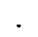 |
| SYMBOL_WIFI_2 |  |
| SYMBOL_WIFI_3 |  |
| SYMBOL_WIFI_4 |  |
| SYMBOL_WIFI_NO_CON_1 |  |
| SYMBOL_WIFI_NO_CON_2 | 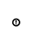 |
| SYMBOL_ENTER |  |
| SYMBOL_OPTION |  |
| SYMBOL_ALARM |  |
| SYMBOL_EYE_OPEN |  |
| SYMBOL_EYE_CLOSE |  |
| SYMBOL_DEGREE | 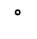 |
| SYMBOL_MICRO |  |
| SYMBOL_UMBRELLA |  |
| SYMBOL_WALKING |  |
| SYMBOL_BACKSPACE |  |


